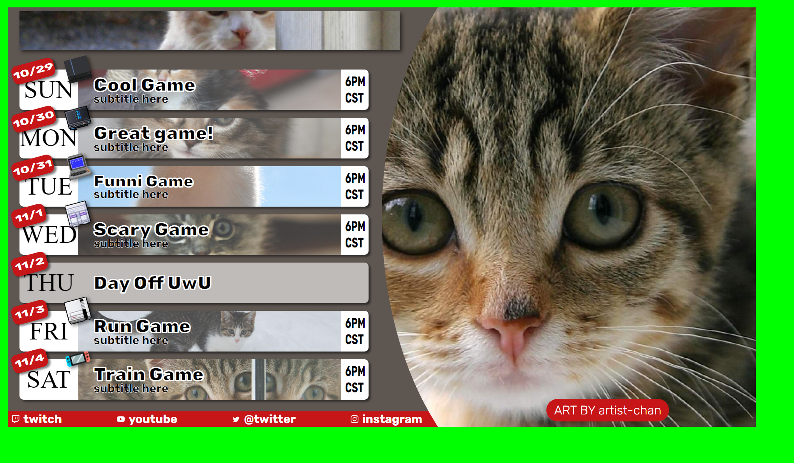

# Stream Schedule Template

This repo is meant to be a basic html template that streamers can use to make schedules. You just need to adjust the text/images then take a screenshot. Then crop out the green parts and you're done.





Couple of notes
* schedule title I made as an image that was 1798 x 184. Could replace this with text if you want.
* If you want to make a day into an "off" day just add the class. 
* If you need to adjust the background image for a day edit the object position in the `.sun-art img` rule.
* big art can be adjusted in the `.art-background img` rule.
* You can add a specific off day message (so text will be centered) with this html
    ```html
    <div class="off-day-message">
        Day Off Message Here
    </div>
    ```
* If you want to have the day background be blurry you can add  `filter: blur(5px);` to the `.game-art img` rule
* You can use comments (`<!-- this is a comment -->`) to hide things. Just remove the comment when you want stuff back.
* You can also hide images by removing the src.
* If you want to remove socials, just delete the ones you don't need/use.